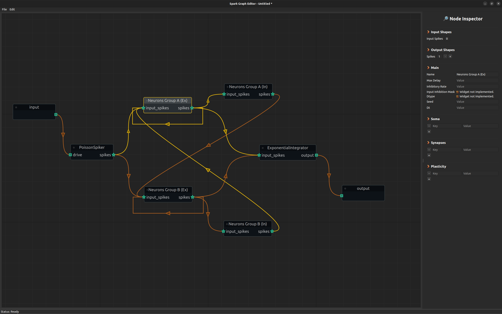

# ⚡ Spark: Modular Spiking Neural Networks

<div align="center"></div>

<p align="center">
    <strong>
        Build, train, and deploy state-of-the-art Spiking Neural Networks with a powerful visual interface and JAX.
    </strong>
    <br/><br/>
    <a href="#">
        
    </a>
    <a href="#">
        
    </a>
    <a href="#">
        
    </a>
    <a href="#">
        
    </a>
</p>

Spark is a next-generation framework designed to simplify and accelerate the research, development, and deployment of non-gradient-base Spiking Neural Networks (SNNs). Our goal is to make SNNs more accessible to researchers, engineers, and enthusiasts by abstracting away boilerplate code and providing intuitive tools for model creation and experimentation, while maintaing state-of-the-art performance.

## Key Features (Philosophy?)

⚡ <strong>High-Performance Backend:</strong> 
Powered by [JAX](https://jax.readthedocs.io/) and [Flax NNX](https://flax.readthedocs.io/), Spark enables just-in-time (JIT) compilation and state management of entire models.

🧩 <strong>Modular & Extensible:</strong> 
Modular by construction.
Everything (that is worth interacting) in Spark is a self-contained module. 
Easily create, modify, and share custom neuron models, synapses, and learning rules.
Ever wanted a neuron with 3 Somas, 2 sets of Synapses and 2.5 Learning rules? As long as it can spike, you came to the right place! 

🔄 <strong>Seamless Workflow:</strong> 
Spiking neural networks are not special, why should they require special data?!. One of the core features of Spark is the concept of input and output interfaces which are simple modules that help you transform regular datasets into streams of spikes and transform streams of spikes back into boring data formats like floats.

🧠 <strong>Graph Editor:</strong> 
Design complex SNN architectures by dragging, dropping, and connecting pre-built neural components. 
No coding required for model design.

## Getting Started

<!--
Spark is available on PyPI, so it can be installed with:


```
pip install spark-snn
```

Or, for the latest development version, clone this repository:
-->
To try Spark, clone this repository and install it via: 
```
git clone https://github.com/nogarx/spark.git
cd spark
pip install -e .
```

## The Spark Graph Editor

Design your network's structure, set parameters for each component, and connect them to create a model.

<div align="center">
    </div>
    <p>
        <em>The Spark visual interface for building SNNs.</em>
    </p>
</div>

Export your model and build it.

```
import spark

# Initialize the configuration class
brain_config = spark.nn.BrainConfig.from_file('./my_awesome_model.scfg')

# Construct the brain.
brain = spark.nn.Brain(config=brain_config)

# Build the brain.
brain(**my_awesome_inputs)
```

To harvest the true power of Spark your model needs to be JIT compiled. Jax requires your model to be traceable, which sometimes can be quite unintutive. Fortunately, this is quite simple in Spark, and most of the time it will look very similar to the next function.

```
import jax

@jax.jit
def run_model(graph, state, **my_awesome_inputs):
    # Reconstruct model
	model = spark.merge(graph, state)
    # Compute
	out = model(**my_awesome_inputs)
    # Split the model and recover its state.
    _, state = spark.split((model))
	return out, state
```

Finally, do the initial split of the model and use your function. 

```
import jax.numpy as jnp

# Some dummy data
my_awesome_inputs = {
    x_0 = jnp.ones((64,), dtype=jnp.float16)
    ...
    x_k = jnp.ones((128,), dtype=jnp.float16)
}

# Split the model
graph, state = spark.split((model))

# Use run_model and reuse state!
out, state = run_model(graph, state, **my_awesome_inputs)

# State now contains the updated state of the model!.
```

There is much more to Spark that what we can show here, if you are ready to learn more you can go to the [tutorial section](https://flax.readthedocs.io/)! 


## Roadmap

We have many exciting features planned. 

🔥 <strong>Components, a lot of them:</strong> 
Spark is built around the idea of modular neurons. Literature is full of really interesting ideas but integrating them to existing code is sometimes annoying and prone to errors. One of our goals is to transform those ideas into modular, reusable and plugable code.

📊 <strong>Built-in Visualization:</strong> 
(Maybe Coming Soon?) Tools for visualizing spike trains, membrane potentials, and network activity in real-time.

🧮 <strong>Custom kernels:</strong>
Spark is fast but it can be faster!. Several operations can be further optimized using custom kernels.

<!--
🧮 <strong>Surrogate gradients:</strong> 
Spark was build with the goal of building recurrent "Heabbian"-like learning schemes and as such it does not support surrogate gradients by default. Spark is also built on top of JAX, which makes automatic differentiation quite straight forward. However, surrogate gradients are typically apply to batched data, which goes against the design philosophy of Spark. We are currently exploring how to integrate surrogate gradients in a way that does not violates our core design. 
--->
## Contributing

Contributions are what make the open-source community such an amazing place. Any contributions you make are greatly appreciated.

## Citing Spark

You can use the following reference to cite this repository, 

<!--
@article{spark_snn_github,
  author = {Mario Franco, Carlos Gershenson},
  title = {Spark: Modular Spiking Neural Networks},
  url = {},
  year = {2025},
}
--->

```
@software{spark_snn_github,
  author = {Mario Franco, Carlos Gershenson},
  title = {Spark: Modular Spiking Neural Networks},
  url = {https://github.com/nogarx/spark/},
  version = {0.1.0},
  year = {2025},
}
```